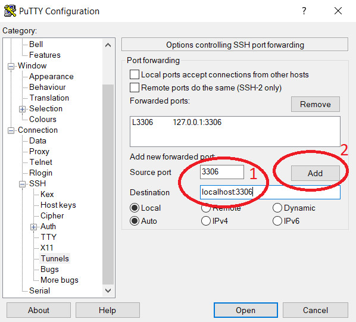
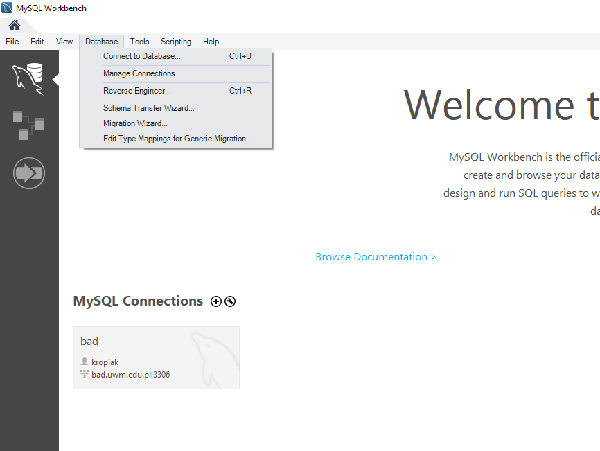
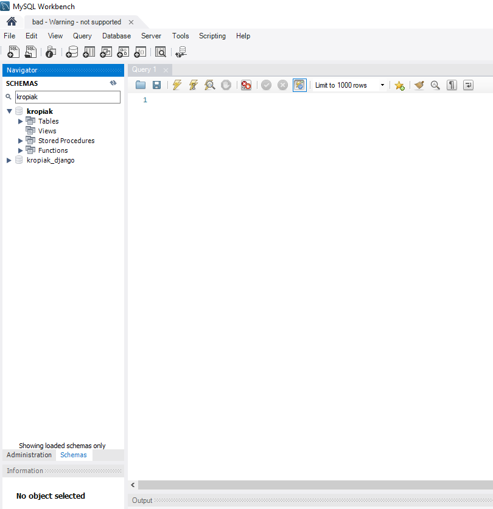

# Dostęp do serwera bazy danych

## **1. Dostęp poprzez Putty**

1. Pobieramy program Putty -> https://www.chiark.greenend.org.uk/~sgtatham/putty/latest.html i instalujemy w systemie.

2. Tworzymy nowe połączenie i jako host podajemy `uwm-a008-36.uwm.edu.pl`, typ połączenia `SSH` oraz port 22. Warto zapisać to połączenie, tak aby wprowadzanie tych danych nie było konieczne przy każdej próbie połączenia z serwerem.

> Przy próbie pierwszego połączenia może pojawić się monit z odciskiem palca serwera i informacją, że nie jest to zewnętrzny certyfikat i nie ma 100% pewności (a czy kiedykolwiek jest?), że to właśnie ten serwer. Jeżeli chcemy sie jednak połączyć to wybieramy opcję `Tak`.

3. Po połączeniu logujemy się do konta shellowego:
* Login: nazwisko studenta bez polskich ogonków + pierwsza litera imienia, np. Jan Kowalski to login kowalskij
* Hasło: imię studenta małymi literami bez polskich ogonków
4. Zmieniamy domyślne hasło poleceniem `passwd` i postępujemy zgodnie z poleceniami na ekranie.
5. Logujemy się do bazy MySQL poleceniem: `mysql –u user –p` gdzie user to nazwa użytkownika bazy danych, która w tym przypadku pokrywa się z loginem do konta shellowego. Hasło udostępnia prowadzący zajęcia.
6. Zmieniamy hasło do bazy poleceniem: `ALTER USER 'user'@'localhost' IDENTIFIED BY 'nowehaslo';`
7. Wybieramy własną bazę poprzez `use nazwa_bazy;` i możemy pracować.

## **2.Instrukcja logowania poprzez MySQL Workbench**

2.1 Serwer MySQL nie jest dostępny na zewnątrz (jego port nie jest wystawiony przez zaporę), więc aby połączyć się z nim musimy utworzyć tunel SSH łączący komputer lokalny z serwerem na porcie 3306 (domyślny port serwera MySQL). Należy to zrobić w opcjach programu Putty w zakładce `Connection -> SSH -> Tunnels` i podać dane tak jak na zrzucie poniżej. Następnie klikamy przycisk `Add` i na liście powyżej powinien pojawić się wpis jak na zrzucie.



Należy zapisać zmiany wracając na zakładkę `Session` wybierając odpowiednią nazwę i wybierając opcję `Save`. Teraz po poprawnym zalogowaniu się do konta shellowego (do systemu Linux) utworzony zostanie tunel, który pozwoli nam na połączenie się np. MySQL Workbencha do zdalnego serwera MySQL.

2.2 Uruchom program MySQL Workbench.



2.3 Wybierz menu `Database` a następnie `Manage connections...`

2.4 Kliknij na dole okna przycisk `New`.

2.5 Podaj dowolną nazwę w polu `Connection name:`. W polu `Hostname` podaj nazwę `localhost`. Port powinien ustawiony na 3306. W polu `username` wpisz nazwę użytkownika podaną przez prowadzącego. Wybierz przycisk `Test connection`, aby sprawdzić czy połaczenie działa.

2.6 W oknie, które się pojawiło wpisz hasło przekazane przez prowadzącego i wybierz `OK`. Jeżeli pojawi się okienko z ostrzeżeniem o niezgodności wersji Workbench i MySQL - zamknij je. Jeżeli pojawił się komunikat o pomyślnym połączeniu można zamknąć okno `Manage connections...`.

2.7 Jeżeli na głównym ekranie pod napisem MySQL Connections nie widać naszego utworzonego połączenia to wybierz z menu `Database` opcję `Connect to Database` i połącz się z bazą.

Po pomyślnym połączeniu ekran powinien wyglądać podobnie do tego poniżej. Różnica będzie w liście baz (SCHEMAS).



## Zmiana hasła do bazy MySQL

Można to zrobić poleceniem SQL:
```sql
SET PASSWORD FOR 'user'@'%'=PASSWORD('nowe_haslo');
flush privileges;
```

Gdzie `user` zamieniamy na nazwę naszego użytkownika a `nowe_haslo` na nowe hasło, które chcemy ustawić.