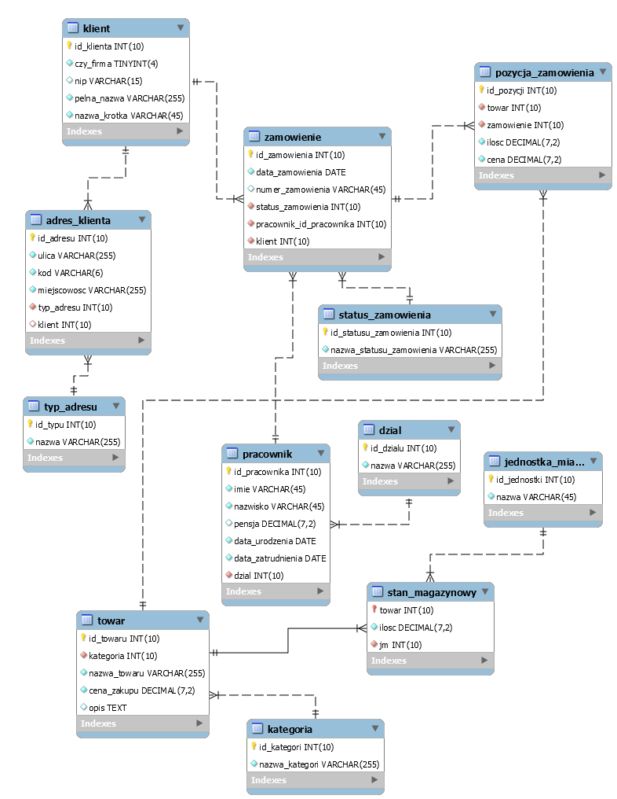
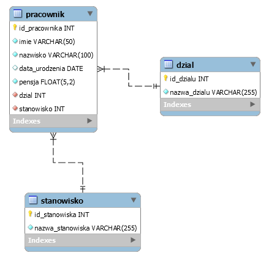

## **2. Pobieranie danych. Złączanie tabel.**

### **2.1 Pobieranie danych.**

Dane z tabel pobieramy za pomocą polecenia `SELECT`, po którym następuje lista kolumn i tabel, z których dane chcemy pobrać.

**_Przykład:_**
```sql
SELECT imie, nazwisko FROM pracownik;

# pobieramy wszystkie kolumny z tabeli.
SELECT * FROM pracownik;
```

Najczęściej będziemy jednak chcieli pobrać dane podając również jakieś warunki, filtry, które ograniczą wynik tylko do zbioru, którym jesteśmy w danym momencie zainteresowani. Te warunki określamy po słowie `WHERE`.

**_Przykład:_**
```sql
# pensja mniejsza od 4000
SELECT imie, nazwisko FROM pracownik WHERE pensja < 4000;

# pensja większa lub równa 3000 i mniejsza niż 4000
SELECT imie, nazwisko FROM pracownik WHERE pensja < 4000 and pensja >= 3000;

# co nie jest może intuicyjne na pierwszy rzut oka, operatory arytmetyczne (<,>, <=, =>) można
# również stosować do wartości tesktowych czy dat
# poniższe zapytanie wyświetli imie i nazwisko gdzie imie jest alfabetycznie za imieniem Paweł
SELECT imie, nazwisko FROM pracownik WHERE imie > 'Paweł';

# można wykorzystać do tego celu wyrażenie BETWEEN
SELECT imie, nazwisko FROM pracownik WHERE pensja BETWEEN 3000 and 4000;

# pobranie imion różnych niż Piotr
SELECT imie, nazwisko FROM pracownik WHERE imie != 'Piotr';
SELECT imie, nazwisko FROM pracownik WHERE imie <> 'Piotr';

# sortowanie danych - ORDER BY kolumna KIERUNEK
# DESC - malejąco
# ASC - rosnąco
SELECT imie, nazwisko FROM pracownik ORDER BY nazwisko ASC;

# kolejną przydatną opcją jest możliwość ograniczenia liczby wyświetlanych wyników.
# poniżej tylko 5 pierwszych wyników
SELECT imie, nazwisko FROM pracownik WHERE imie LIKE 'A%' ORDER BY nazwisko ASC LIMIT 5;

# poniżej wyniki od 6 do 15 (po 5 kolejne 10 wyników)
SELECT imie, nazwisko FROM pracownik WHERE imie LIKE 'A%' ORDER BY nazwisko ASC LIMIT 5, 10;

```

Oprócz dokładnego określenia wartości filtra możemy również użyć prostego wyrażenia regularnego czyli wzorca, do którego dopasowania (lub nie jeżeli użyjemy negacji) wartości szukamy.
Wykorzystujemy w tym celu wyrażenie `LIKE` oraz elementy wyrażeń regularnych, które w przypadku MySQL są ograniczone tylko do:

* % - dowolny ciąg o długości 0 lub większej
* _ - dokładnie jeden dowolny znak

**_Przykład:_**
```sql
# pobieramy imiona rozpoczynające się od litery 'A'
SELECT imie from pracownik WHERE imie LIKE 'A%';

# lub takie, które od 'A' się nie rozpoczynają
SELECT imie from pracownik WHERE imie NOT LIKE 'A%';

# imiona zawierające literę 'a'
SELECT imie from pracownik WHERE imie LIKE '%a%';

# imiona rozpoczynające się na literę 'A' mające dokładnie 4 znaki
SELECT imie from pracownik WHERE imie LIKE 'A___';
```
**Wykorzystując `SELECT` wraz z `CREATE`** można stworzyć tabelę na podstawie wyników zapytania.

**_Przykład:_**
```sql
CREATE TABLE pracownik_kopia SELECT * FROM pracownik;

# można stworzyć też tabelę bez danych z poleceniem LIKE
CREATE TABLE pracownik_kopia_2 LIKE pracownik;

# wykorzystując `SELECT` można również dane do tabeli wstawić
INSERT INTO pracownik_kopia_2 SELECT * FROM pracownik WHERE pensja > 3000;
```

Zadania, które zostały przygotowane jako praktyka wiedzy teoretycznej oparte są o bazę, której schemat został przedstawiony poniżej.




**Zadania - część 1**

1. Z tabeli `pracownik` wyświetl nazwiska posortowane alfabetycznie od A do Z.
2. Z tabeli `pracownik` wyświetl imie, nazwisko, pensję dla pracowników urodzonych po roku 1979.
3. Z tabeli `pracownik` wyświetl wszystkie informacje dla pracowników z pensją pomiędzy 3500 a 5000.
4. Z tabeli `stan_magazynowy` wyświetl towary, których ilość jest większa niż 10.
5. Z tabeli `towar` wyświetl wszystkie towary, których nazwa zaczyna się od A, B lub C.
6. Z tabeli `klient` wyświetl wszystkich klientów indywidualnych (nie firmy).
7. Z tabeli `zamowienie` wyświetl 10 najnowszych zamówień.
8. Z tabeli `pracownik` wyświetl 5 najmniej zarabiających pracowników.
9. Z tabeli `towar` wyświetl 10 najdroższych towarów, których nazwa nie zawiera litery 'a'.
10. Z tabeli `towar` wyświetl towar, których jednostka miary to 'szt', posortuj po nazwie (ad A do Z) następnie po cenie zakupu malejąco.
11. Stwórz nową tabelę o nazwie towary_powyzej_100, do której wstaw towary, których cena jest większa równa 100. Użyj `CREATE ... SELECT`.
12. Stwórz nową tabelę o nazwie pracownik_50_plus na podstawie tabeli pracownik z wykorzystaniem `LIKE`. Wstaw do tej tabeli wszystkie rekordy z tabeli `pracownik` gdzie wiek pracownika jest większy równy 50 lat.

### **2.2 Pobieranie danych i złączanie tabel.**

W sytuacji gdzie dane, które chcemy pobrać znajdują się w różnych tabelach należy wykorzystać mechanizm złączania tabel, którego użycie jest niezbędne, aby wskazać, w jaki sposób połączyć dane z wielu tabel w jeden/wiele wierszy wynikowych.

Przykład zostanie zaprezentowany na podstawie schematu bazy z laboratorium 1.


Na powyższym schemacie w tabeli `pracownik` kolumna `dzial` przechowuje id dzialu, do jakiego przypisany jest pracownik. Obie tabele połączone są relacją wiele do jednego (klucz oobcy -> klucz główny). Wyobraźmy sobie teraz sytuację, w której chcemy wyświetlić `imie, nazwisko, nazwa_dzialu`. Te dane znajdują się w dwóch tabelach. Rozważmy poniższy przykład:

**_Przykład:_**
```sql
SELECT imie, nazwisko, nazwa_dzialu FROM pracownik, dzial;
```
**Jaki będzie efekt zapytania ?**

Na pewno nie taki jak w założeniu.

Aby zwrócic poprawny wynik chcemy znaleźć w tabeli dzial wartość kolumny `nazwa_dzialu` dopasowując przypisaną do niej wartość `id_dzialu` odpowiadającą wartości kolumny `dzial` z tabeli `pracownik`.

**_Przykład:_**
```sql
SELECT imie, nazwisko, nazwa_dzialu FROM pracownik, dzial WHERE dzial.id_dzialu=pracownik.dzial;

# ekwiwalentem powyższego złączania jest również `INNER JOIN`
SELECT imie, nazwisko, nazwa_dzialu FROM pracownik INNER JOIN dzial ON dzial.id_dzialu=pracownik.dzial;
```


Rozpatrzmy jeszcze 2 przykłady zapytań wybierających.

Wykorzystanie złączania `LEFT JOIN`. Taki typ złączania stosujemy wtedy gdy chcemy wyświetlić wszystkie wybierane wartości z `lewej` kolumny (czyli jako pierwszy zbiór) i informacje z kolejnego zbioru gdzie dopasowania zostały znalezione lub nie (wtedy brak dopasowani będzie wyświetlony jako wartość `NULL`).

Przyjmijmy, że interesuje nas informacja o tym, którzy pracownicy nie złożyli żadnego zamówienia. 

* Krok 1 - najpierw musimy określić, w których tabelach ta informacja się znajduje. Są to tabele `pracownik` oraz `zamowienie`.

* Krok 2 - jak okreslić warunek zapytania ? W naszym przypadku patrząc na schemat będzie to oznaczało, że szukamy różnicy zbiorów. Szukamy więc pracowników (właściwie id do nich przypisanych), które występują w tabeli `pracownik`, ale nie występują w tabeli `zamowienia` (jest tam klucz obcy do tabeli `pracownik`). Spójrzmy na grafikę poniżej, prezentującą przykłady wykorzystania złączania. Który z nich będzie tym, który w tym przypadku będzie odpowiedni ? 


Zadanie możemy rozwiązać wykorzystując 2 techniki.
1. Wykorzystujemy `LEFT JOIN`.

**_Przykład:_**
```sql
SELECT imie, nazwisko FROM pracownik LEFT JOIN zamowienie ON pracownik.id_pracownika=zamowienie.pracownik_id_pracownika WHERE pracownik_id_pracownika is NULL;
```

Aby mieć pełen obraz jak wygląda wynik bez warunku `WHERE` i co możemy z nim zrobić wykonajmy poniższe zapytanie:
```sql

SELECT imie, nazwisko, pracownik_id_pracownika FROM pracownik LEFT JOIN zamowienie ON pracownik.id_pracownika=zamowienie.pracownik_id_pracownika;
```

2. Wykorzystujemy podzapytanie.

Tutaj wykorzystamy zapytanie z warunkiem zawierania się czyli `IN` lub `NOT IN`.

**_Przykład:_**
```sql
SELECT imie, nazwisko FROM pracownik WHERE id_pracownika IN (2,3,4);
```

Powyższy przykład wyświetla wiersze, gdzie id_pracownika zawiera się w zbiorze {2,3,4}.
Taki zbiór może być wynikiem zapytania wybierającego `SELECT` co będziemy okreslać podzapytaniem.

**_Przykład:_**
```sql
SELECT imie, nazwisko FROM pracownik WHERE id_pracownika IN (SELECT pracownik_id_pracownika FROM zamowienie);
```

Otrzymaliśmy wszystkie imiona i nazwiska pracowników, których id występuje w tabeli `zamowienia`. Aby osiągnąć taki sam efek jak z wykorzystaniem `LEFT JOIN` trzeba odwrócić warunek.

**_Przykład:_**
```sql
SELECT imie, nazwisko FROM pracownik WHERE id_pracownika NOT IN (SELECT pracownik_id_pracownika FROM zamowienie);
```

Więcej o typach złączania i jego efektach na grafice poniżej.


**Zadania - część 2**

1. Wyświetl imie, nazwisko i nazwę działu każdego pracownika.
2. Wyświetl nazwę towaru, nazwę kategorii oraz ilość towaru i posortuj dane po kolumnie ilość malejąco.
3. Wyświetl wszystkie anulowane zamówienia.
4. Wyświetl wszystkich klientów, których adres podstawowy znajduje się w miejscowości Olsztyn.
5. Wyświetl wszystkie nazwy jednostek miary, które nie zostały nigdy wykorzystane w tabeli `stan_magazynowy`.
6. Wyświetl numer zamówienia, nazwę towaru, ilosc i cenę dla zamówień złożonych w 2018 roku.
7. Stwórz nową tabelę o nazwie towary_full_info, w której znajdą się kolumny nazwa_towaru, cena_zakupu, kategoria(nazwa),ilosc , jednostka miary(nazwa).
8. Wyświetl pozycje zamówień dla 5 najstarszych zamówień.
9. Wyświetl wszystkie zamówienia, które mają status inny niż `zrealizowane`.
10. Wyświetl wszystkie adresy, których kod został niepoprawnie zapisany.