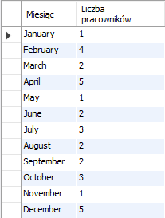

# Lab 3. Zadania część 2

**Zadanie 1**

Wyświetl nazwę działu i minimalną, maksymalną i średnią wartość pensji w każdym dziale.

**Zadanie 2**

Wyświetl pełną nazwę klienta, wartość zamówienia dla 10 najwyższych wartości zamówienia.

**Zadanie 3**

Wyświetl wartość przychodu dla każdego roku. Dane posortuj malejąco według sumy wartości zamówień.

**Zadanie 4**

Wyświetl sumę wartości wszystkich anulowanych zamówień.

**Zadanie 5**

Wyświetl liczbę zamówień i sumę zamówień dla każdego miasta z podstawowego adresu klientów.

**Zadanie 6**

Wyświetl dotychczasowy dochód firmy biorąc pod uwagę tylko zamówienia zrealizowane.

**Zadanie 7**

Policz i wyświetl dochód (przychód z zamówień - cena zakupu towaru) w każdym roku działalności firmy.

**Zadanie 8**

Wyświetl wartość aktualnego stanu magazynowego z podziałem na kategorię produktów.

**Zadanie 9**

Przygotuj zapytanie, które wyświetli dane w poniższej postaci (policz ilu pracowników urodziło się w danym miesiącu - uwaga na porządek sortowania).

**Zadanie 10** *

Wyświetl imię i nazwisko pracownika i koszt jaki poniósł pracodawca od momentu jego zatrudnienia.

* Nie aż tak trudne jak poszukać odpowiedniej funkcji operującej na datach.

