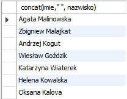
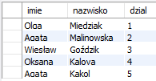
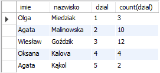
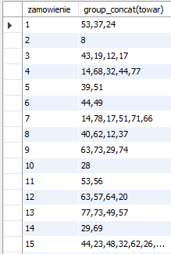

# _Przedmiot: Systemy baz danych_

## **3. Wybrane funkcje wbudowane MySQL. Grupowanie danych.**

### **3.1 Funkcje tekstowe.**

#### Funkcja length()

Funkcja length zwraca ilość znaków tekstu przekazanego jako argument funkcji:

**Przykład 1:**
```sql
# funkcja zwróci ilość znaków dla każdego imienia w tabeli pracownik
SELECT length(imie) FROM pracownik;
```

#### Funkcja substring()

Funkcja `substring(tekst, start, dlugosc)` zwraca fragment tekstu z atrybutu `tekst` o długości `dlugosc` rozpoczynając od znaku na pozycji `start`. Funkcja posiada równiez synonim - funkcja `substr(teskts, start, dlugosc)`.

**Przykład 2:**
```sql
# funkcja zwróci pierwszą literę imienia i pierwszą literę nazwiska
SELECT substring(imie, 1, 1), substring(nazwisko, 1, 1) FROM pracownik;
```

#### Funkcja concat()

Funkcja `concat(tekst, tekst)` złącza przekazane atrybuty tekstowe w jeden ciąg tekstowy.

**Przykład 3:**
```sql
# wynikiem będzie pojedyncza kolumna
SELECT concat(imie," ", nazwisko) FROM pracownik;
```

**Wynik:**



#### Funkcja lower() i upper()

Funkcje `lower(teskt)` i `upper(tekst)` odpowiednio zwraca postać tekstu małymi i dużymi literami.

**Przykład 4:**
```sql
SELECT upper(nazwa_towaru) FROM towar;
```

#### Funkcja reverse()

Funkcja `reverse(tekst)` zwraca tekst w postaci odwróconej.

**Przykład 5:**
```sql
SELECT reverse(imie) FROM pracownik;
```

### **3.2 Funkcje daty.**

#### Funkcja now(), date(data i/lub czas), curdate(), current_date(), current_time(), current_timestamp()

Wymienione funkcje mają wspólną cechę polegającą na tym, że zwracają datę i/lub czas. Są jednak pomiędzy nimi pewne różnice.

W MySQL istnieje wartość `CURRENT_TIMESTAMP`, która może być wartością domyślną dla kolumny z typem daty i czasu. Oznaczać to będzie, że w momencie wstawiania nowej wartości do tabeli w tej kolumnie zostanie wstawiona aktualna data i czas. Ekwiwalentem są dwie wymienione w nagłówku funkcje `now()` oraz `CURRENT_TIMESTAMP()`.

**Przykład 6:**
```sql
# zwróci aktualną datę i czas
SELECT CURRENT_TIMESTAMP;
```

Funkcja `data(data i/lub czas)` zwraca tylko datę.

**Przykład 7:**
```sql
# zwróci wartość '2008-05-17'
SELECT DATE('2008-05-17 11:31:31') as data;

# zwraca aktualną datę systemową
SELECT curdate();
```

#### Funkcja adddate(data, interval)

Funkcja `adddate` jest bardzo przydatna w momencie kiedy chcemy dodać do siebie daty i/lub czas.

**Przykład 8:**
```sql
# zostanie zwrócona data o 14 większa niż data zapisana w kolumnie termin_platnosci
SELECT ADDDATE(termin_platnosci, INTERVAL 14 DAY) FROM faktura;
```
Funkcja, która odejmuje daty w podobny sposób to `subdate()`.
Więcej informacji [tutaj](https://w3resource.com/mysql/date-and-time-functions/mysql-adddate-function.php)


#### Funkcje year(data), month(data), day(data), hour(data), minute(data), second(data), microsecond(data)

Powyższe funkcje zwracają wybraną część z daty przekazanej jako argument.

**Przykład 9:**
```sql
# zwraca numer miesiąca, w którym się urodził dany pracownik
SELECT month(data_urodzenia) FROM pracownik WHERE id_pracownika=1;
```

#### Funkcja `datediff(data1, data2)`

Funkcja `datediff` zwraca różnicę podaną w dniach, między dwiema datami. W zależności od tego, która z nich będzie 'nowsza' wynik będzie liczbą dodatnią lub ujemną.

**Przykład 10:**
```sql
SELECT datediff(data_urodzenia, now()) FROM pracownik WHERE id_pracownika=1;
```

#### Funkcja `week(data, [tryb])`

Funkcja `week` zwraca numer tygodnia w zależności od wybranego trybu (patrz link pod przykładem).

**Przykład 11:**
```sql
SELECT week(data_zamowienia) FROM zamowienie ORDER BY id_zamowienia DESC LIMIT 1;
```

Więcej o funkcji `week()` [tutaj](https://www.w3resource.com/mysql/date-and-time-functions/mysql-week-function.php)


### **3.3 Wyrażenie `DISTINCT i funkcje count() oraz distinct()`**

Jeżeli interesuje nas informacja o ilości wierszy, które zwraca zapytanie pomocna będzie funkcja 
`count()`.

**Przykład 12:**
```sql
# zwraca liczbę rekordów w tabeli pracownik
SELECT count(*) FROM pracownik;
```

Czasem potrzebujemy również policzyć, wyświetlić tylko rekordy unikalne. Wykorzystamy do tego funkcję `count()` oraz `distinct()`.

**Przykład 13:**
```sql
# zwraca unikalne wartości w kolumnie nazwisko
SELECT DISTINCT nazwisko FROM pracownik;
# lub
SELECT distinct(nazwisko) FROM pracownik;

# a jeżeli interesuje nas liczba unikalnych wartości
SELECT count(distinct(nazwisko)) from pracownik;
```

### **3.4 Grupowanie danych i funkcje agregujące.**

Grupowanie danych polega na ich złączaniu w zbiory o tej samej wartości w kolumnie (kolumnach), które zostały określone jako parametr wyrażenia `GROUP BY` (nie mylić z sortowaniem poprzez `ORDER BY`).

Rozważmy poniższy przykład:

**Przykład 14:**
```sql
# zwraca liczbę rekordów w tabeli pracownik
SELECT imie, nazwisko, dzial FROM pracownik GROUP BY dzial;
```
Wynik tego zapytania to:



Czyli coś jest nie tak, bo pracowników w tabeli jest 31. Ale działów faktycznie tylko 5. Takie zapytanie zwróciło pierwszy wiersz z każdej grupy. Można to sprawdzić zapytaniem:
```sql 
SELECT imie, nazwisko, dzial FROM pracownik ORDER BY id_pracownika ASC, dzial ASC;
```

Jeżeli dokładnie prześledzimy wyniki to pierwszy pracownik w każdym dziale został wyświetlony w poprzednim zapytaniu.

`GROUP BY` jest wyrażeniem, które oczekuje, że na na grupie wykonamy jakąś funkcję agregującą.

Wykorzystajmy poznaną już wcześniej funkcję `count()`. Policzmy pracowników w każdym dziale.

**Przykład 15:**
```sql
SELECT imie, nazwisko, dzial, count(dzial) FROM pracownik GROUP BY dzial;
```
**Wynik:**




Innymi funkcjami agregującymi są:

* sum(zbiór liczb) - zwraca sumę wartości,
* avg(zbiór liczb) - zwraca średnią liczb,
* min(zbiór liczb) - zwraca wartość najmniejszą,
* max(zbiór liczb) - zwraca wartość największą.
* group_concat(łańcuchy tekstowe) -  zwraca pojedynczy łańcuch tekstowy (podobnie jak CONCAT())

Nie używając wyrażenia `GROUP BY` kiedy uzywamy funkcję agregującą liczymy wartość dla wszystkich rekordów zwracanych przez zapytanie.

**Przykład 16:**
```sql
SELECT avg(cena_zakupu) FROM towar;
```

**Wynik:**


Jeżeli zachodzi potrzeba zaokrąglenia wyniku możemy wykorzystać funkcję `round(liczba, precyzja)`.

Pdobnie jak w przypadku sortowania możemy okreslić również kilka poziomów grupowania w jednym zapytaniu.

Poniżej zaprezentowany został przykład wykorzystania funkcji `GROUP_CONCAT()`.


**Przykład 17:**
```sql
SELECT zamowienie, group_concat(towar) FROM pozycja_zamowienia GROUP BY zamowienie;
```

**Wynik:**



**Zadania**

Pierwsza część zadań została umieszczona w pliku [lab_3_zadania_1.md](lab_3_zadania_1.md).


#### Warunki dla kolumn zagregowanych

Do tej pory warunki określaliśmy w części `WHERE` to dla kolumn, na których używamy funkcji agregujących musimy to zrobić przez `HAVING`. Poniższy przykład wyświetli id działu, jego liczebność, jeżeli ta liczebność jest wieksza niż 2. Kolejność `GROUP BY` i `HAVING` nie jest przypadkowa.

**Przykład 18:**
```sql
SELECT dzial, count(dzial) FROM pracownik GROUP BY dzial HAVING count(dzial) > 2;
```

Druga część zadań została umieszczona w pliku [lab_3_zadania_2.md](lab_3_zadania_2.md).

## **Dodatkowe zasoby**

Komplementarną listę funkcji MySQL nie ujętych tutaj można znaleźć pod adresem ['https://www.w3resource.com/mysql/mysql-functions-and-operators.php'](https://www.w3resource.com/mysql/mysql-functions-and-operators.php).