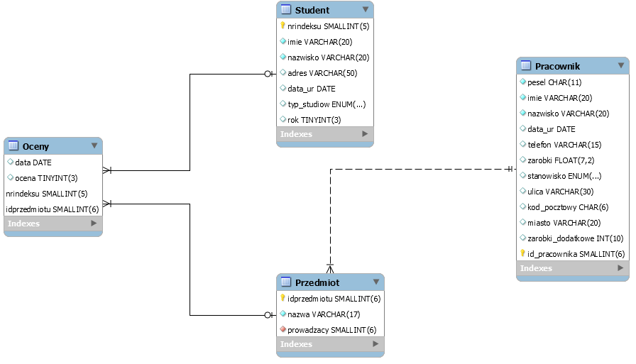

# Modelowanie danych na potrzeby baz danych.

## 1. Etapy projektowania.

Przygotowanie finalnego modelu danych możemy podzielić na 3 etapy.

**1. Model konceptualny:**  
  * analiza biznesu,
  * określenie wymagań klienta,
  * scenariusze użycia.

**2. Model logiczny:**
  * znajomość relacji między danymi,
  * model związków encji,
  * normalizacja bazy danych.

**3. Model fizyczny:**
* wygenerowanie kodu SQL dla wybranego silnika bazy danych,
* indeksy, widoki,
* kolumny techniczne.

Modelowanie bazy polega na stworzeniu struktury tabel i relacji ich łączących,
które umożliwią przechowywanie i dostęp do nich w sposób efektywny. Spójność
danych jest również bardzo ważnym aspektem i chociaż silniki baz danych zapewniają
stosowne mechanizmy, ale dopiero poprzez odpowiednio zaimplementowane relacje
można tę spójność zapewnić.
Poniżej został przedstawiony przykładowy diagram związków encji (model bazy),
który przedstawia 4 tabele połączone ze sobą relacjami.

## 2. Model na zajęciach.

W trakcie zajęć prowadzący zaprezentuje kolejne etapy przygotowania koncepcji oraz projektu związków encji za pomocą oprogramowania MySQL Workbench dla wymyślonego przez studentów problemu. Po zajęciach te modele zostaną umieszczone w ninniejszym podrozdziale.

Oficjalna dokumentacja narzędzia MySQL Workbench dostępna jest pod adresem: https://dev.mysql.com/doc/workbench/en/

Do repozytoirum został dołączony również schemat (plik [relacje](relacje.mwb) prezentujący kilka przykładów rodzajów relacji, tak aby przedstawić ten koncept, jeżeli nie został jeszcze zaprezentowany na wykładach. Dodatkowo wyjaśnienie można znaleźć w ciekawej i podpartej przykładami dyskusji pod adresem: https://doraprojects.net/questions/40688399/non-identifying-relationship-vs-identifying-relationship-in-mysql-workbench

Bardziej kompleksowe wyjaśnienie rodzajów relacji można znaleźć tutaj: https://www.sqlpedia.pl/relacyjne-bazy-danych-pojecia-podstawowe/

## 3. Zadania.

Korzystając z MySql Workbench przygotuj model bazy danych w postaci diagramu związków encji dla scenariusza opisanego poniżej.

**Scenariusz 1** 

Twoim zadaniem jest zaprojektowanie modelu bazy dla firmy organizującej eventy.

Postaraj się przewidzieć możliwość przechowywania podstawowych informacji o firmie oraz o:
* Kontrahentach,
* Pracownikach,
* Eventach,
* Rozliczeniach z kontrahentami (dostawcy, odbiorcy).

Dla każdego eventu należy umożliwić zapisanie jego nazwy, daty, miejsca i kontrahenta, dla którego jest organizowany. Każdy event należy też rozliczyć, więc powinna być możliwość podpięcia dokumentu finansowego (paragon, faktura). Z organizacją eventu związane są też koszty, dzięki czemu możliwe będzie wyświetlenie informacji z bazy pozwalających na wyznaczenie bilansu każdego eventu (przychód – koszty). Event może też zostać odwołany z różnych powodów.

Oprócz podstawowych danych o pracownikach należy również uwzględnić możliwość przypisania użytkownika do działu, liczba działów może z czasem ulegać zmianie.
Każdy pracownik pobiera też pensję, co wraz z informacjami finansowymi eventów pozwoli na przygotowanie bilansów miesięcznych, kwartalnych lub rocznych.

**Scenariusz 2**

Przygotuj model związków encji dla finałów Mistrzostw Świata w piłce nożnej.
Musisz przewidzieć możliwość przechowywania informacji o drużynach, piłkarzach, sztabie drużyny, wszystkich stadionach finałów oraz sędziach, którzy te spotkania mogą prowadzić. Należy również przemyśleć i zamodelować sposób przechowywania meczów oraz ich wyników. Powinna też istnieć możliwość odczytania ilości strzelonych bramek przez poszczególnych zawodników. Jak wiadomo MŚ są też podzielone na dwie fazy – fazę grupową oraz fazę play-off. Ten fakt również powinien zostać uwzględniony.