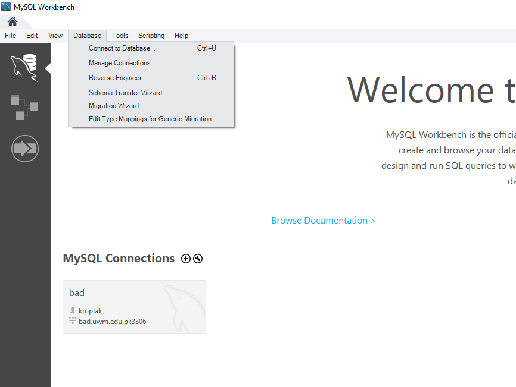
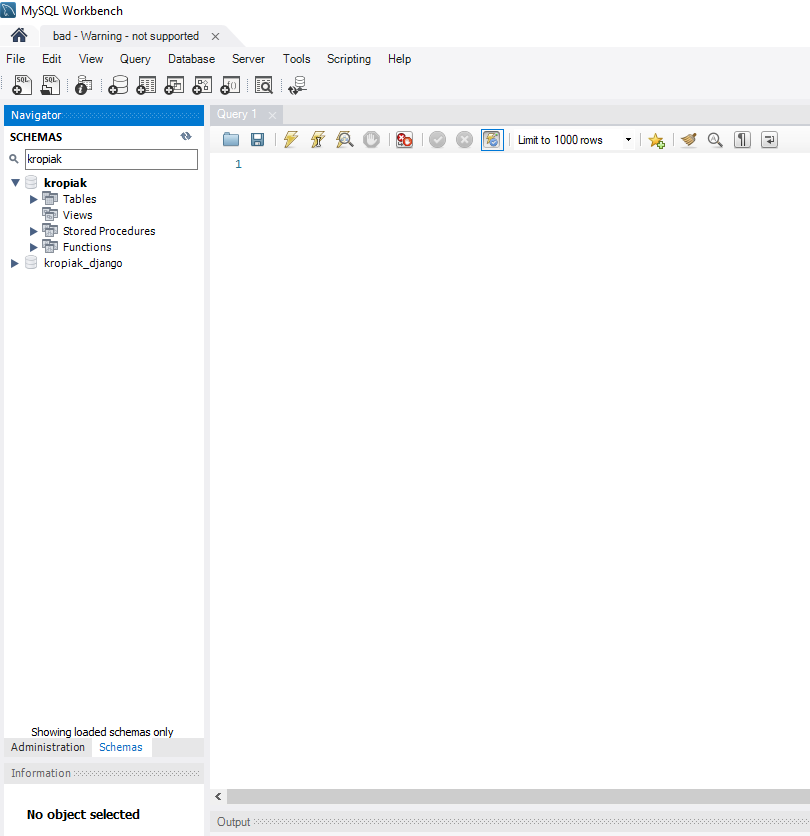

# Zaawansowane Technologie Informatyczne
## Przedmiot: bazy danych

## **1.Instrukcja logowania poprzez MySQL Workbench**

1.1 Uruchom program MySQL Workbench.



1.2 Wybierz menu `Database` a następnie `Manage connections...`

1.3 Kliknij na dole okna przycisk `New`.

1.4 Podaj dowolną nazwę w polu `Connection name:`. W polu `Hostname` podaj nazwę `bad.uwm.edu.pl`. Port powinien ustawiony na 3306. W polu `username` wpisz nazwę użytkownika podaną przez prowadzącego. Wybierz przycisk `Test connection`, aby sprawdzić czy połaczenie działa.

1.5 W oknie, które się pojawiło wpisz hasło przekazane przez prowadzącego i wybierz `OK`. Jeżeli pojawi się okienko z ostrzeżeniem o niezgodności wersji Workbench i MySQL - zamknij je. Jeżeli pojawił się komunikat o pomyślnym połączeniu można zamknąć okno `Manage connections...`.

1.6 Jeżeli na głównym ekranie pod napisem MySQL Connections nie widać naszego utworzonego połączenia to wybierz z menu `Database` opcję `Connect to Database` i połącz się z bazą.

Po pomyślnym połączeniu ekran powinien wyglądać podobnie do tego poniżej. Różnica będzie w liście baz (SCHEMAS).



## Zmiana hasła do bazy MySQL

Można to zrobić poleceniem SQL:
```sql
SET PASSWORD FOR 'user'@'%'=PASSWORD('nowe_haslo');
flush privileges;
```

Gdzie `user` zamieniamy na nazwę naszego użytkownika a `nowe_haslo` na nowe hasło, które chcemy ustawić.